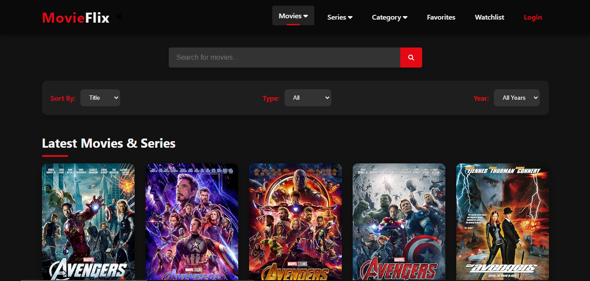

## Live Demo
Check out the live version of this project: [Live Demo](https://your-live-demo-link.com)# 🎬 


MovieFlix - Search Movies & TV Shows

MovieFlix is a user-friendly movie and TV show search application where users can discover, filter, and manage their favorite content with ease.

## 📌 Features

- 🔎 **Search Movies & TV Shows** - Search for your favorite movies and TV series.
- 📂 **Category-Based Filtering** - Filter content by genre, platform, or language.
- 🌟 **Favorites & Watchlist** - Save movies to your favorites and watchlist.
- 🌙 **Dark Mode Toggle** - Seamless light and dark mode switching.
- 📊 **User Ratings & Reviews** - View IMDb ratings and leave user reviews.
- 🎞️ **Movie Details & Trailer** - Access movie details including cast, plot, and trailers.
- 📤 **Share Feature** - Share movie details on social media.
- 🔥 **Recent Searches** - View and manage your recent searches.
- 🛠️ **Responsive & User-Friendly UI** - Optimized for all devices.

## 🏗️ Tech Stack

- **Frontend**: HTML, CSS, JavaScript
- **Styling**: Tailwind CSS (or regular CSS)
- **Icons**: FontAwesome
- **API**: OMDb API (for fetching movie details)
- **Deployment**: Netlify / Vercel

## 📸 Screenshots

### Homepage



## 🚀 Installation & Usage

1. **Clone the repository**
   ```bash
   git clone https://github.com/yourusername/movieflix.git
   cd movieflix


2. ## 🛠️ API Setup
- Create an account on OMDb API and obtain an API key.
This project uses the OMDb API to fetch movie details.
Get an API key from OMDb API.
Replace the API_KEY in script.js with your key.


3. ## 💡 Contributing
Contributions are welcome! Feel free to fork the repository, make changes, and submit a pull request.

4. ## 📜 License
This project is licensed under the MIT License.


## Developed with ❤️ by SUMIT KUMAR